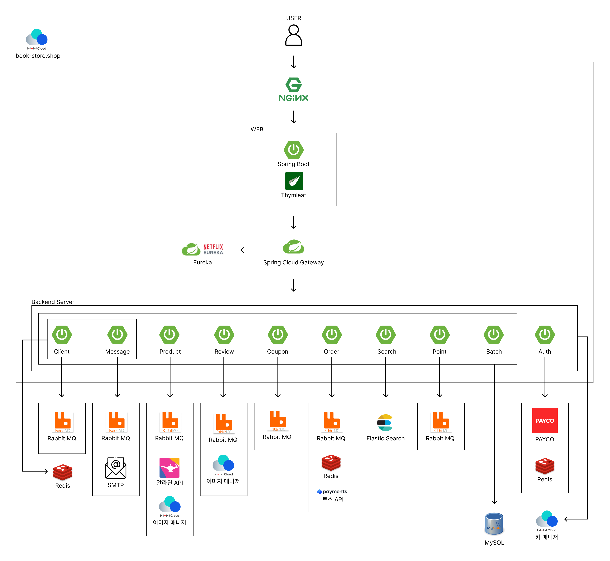
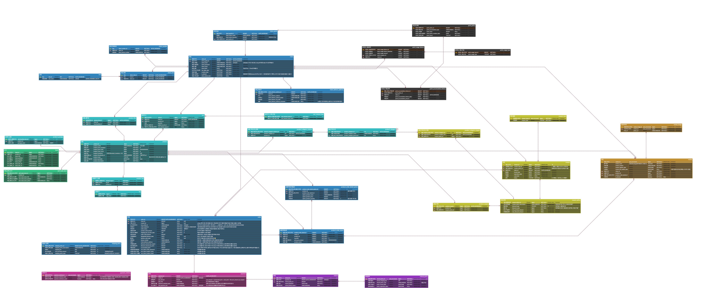

# [Book Store](https://book-store.shop/)

## 📚 소개

저희 Book Store 어플리케이션에서 관리자는 쉽게 상품 및 쿠폰, 배송 상태 등을 관리하고, 사용자 리뷰 및 평점 시스템을 모니터링할 수 있습니다. 
사용자는 방대한 양의 도서 상품을 보유한 저희 어플리케이션에서 다양한 기준의 검색 기능을 통하여 원하는 도서를 손쉽게 구매할수 있도록 합니다. 
또한, 상품에 대한 리뷰 및 평점 시스템을 통해 사용자들 간의 경험 공유할 수있습니다.

### 📆 프로젝트 기간

2024.06.11. ~ 08.02.

### 🙋‍♂️ 참가인원
<table style="text-align:center;">
   <tr>
    <td><b>박희원</b></td>
    <td><b>장기환</b></td>
    <td><b>강인준</b></td>
    <td><b>전민선</b></td>
  </tr>
  <tr>
    <td>
        
    </td>
    <td>
        
    </td>
    <td>
        
    </td>
    <td>
        
    </td>
  </tr>
</table>

## 🚀 프로젝트 기능 소개

[🌐 Front Service](https://github.com/nhnacademy-be6-code-quest/web)

[🔒 Auth Service](https://github.com/nhnacademy-be6-code-quest/service-auth)

[👥 Client Service](https://github.com/nhnacademy-be6-code-quest/service-client)

[📊 Client Batch Service](https://github.com/nhnacademy-be6-code-quest/client-batch)

[✉️ Message Service](https://github.com/nhnacademy-be6-code-quest/message)

[🛍️ Product Servicee](https://github.com/nhnacademy-be6-code-quest/service-product)

[🔍 Search Service](https://github.com/nhnacademy-be6-code-quest/service-search)

[⭐ Review Service](https://github.com/nhnacademy-be6-code-quest/service-review-v2)

[🛒 Order Service](https://github.com/nhnacademy-be6-code-quest/service-order_payment_refund)

[🎟️ Coupon Service](https://github.com/nhnacademy-be6-code-quest/service-coupon)

[📋 Coupon Batch Service](https://github.com/nhnacademy-be6-code-quest/coupon_service_batch)

[💎 Point Service](https://github.com/nhnacademy-be6-code-quest/service-point)

[🚪 Gateway Service](https://github.com/nhnacademy-be6-code-quest/gateway)

[🔗 Eureka Service](https://github.com/nhnacademy-be6-code-quest/eureka)

  
### Architecture

### 🛠 Tools
Frontend

    
    
    
    

Backend

    
    
    
    
    

Messaging

    

Database

    
    
    

IDE

    
    

CI

    
    

## ERD

