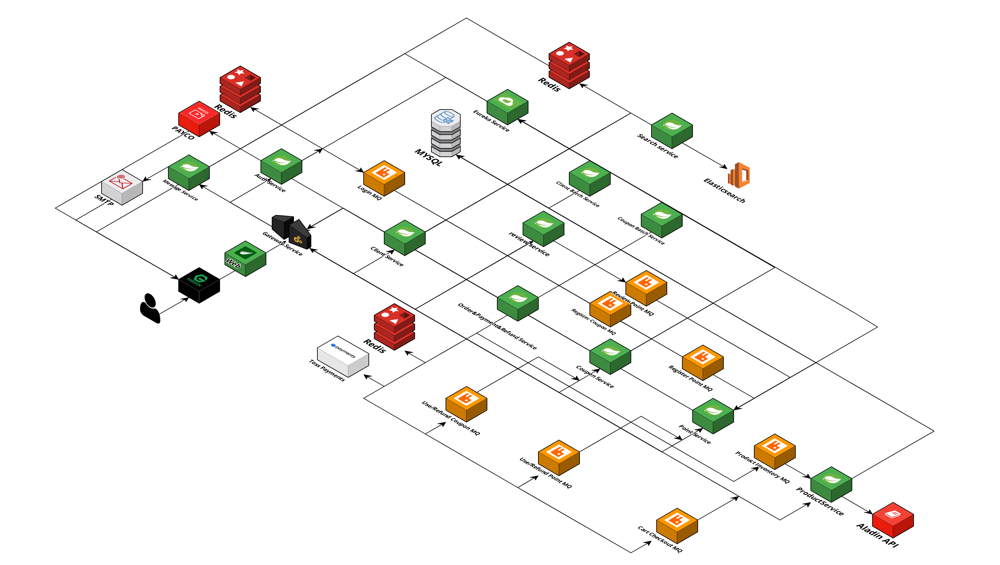

# [Book Store](https://book-store.shop/)

## 📚 소개

 당신의 독서 경험을 한 단계 높여줄 현대의 독서 체험을 소개합니다.  
저희 Book Store는 오늘날의 다양하고 풍부한 문학 세계를 여러분에게 한 번에 열어줍니다.  
책 속으로 빠져들고 싶을 때, 당신이 원하는 책을 찾을 수 있도록 손끝에 닿는 곳에서 지원합니다.

우리는 당신의 호기심과 배움에 전념합니다.  
문학의 풍요로움을 향유하고 싶은 분들을 위해 고전부터 현대 문학, 철학에서 과학까지 폭넓은 주제를 다루는 책들을 모아왔습니다.  
흥미롭고 다양한 장르의 책들이 여러분을 기다리고 있습니다. 당신이 원하는 이야기가 여기 있습니다.

### 📆 프로젝트 기간

2024.06.11. ~ 08.02.

### 🙋‍♂️ 참가인원
<table style="text-align:center;">
   <tr>
    <td><b>박희원</b></td>
    <td><b>장기환</b></td>
    <td><b>강인준</b></td>
    <td><b>전민선</b></td>
  </tr>
  <tr>
    <td>
        
    </td>
    <td>
        
    </td>
    <td>
        
    </td>
    <td>
        
    </td>
  </tr>
</table>

## 🚀 프로젝트 기능 소개

[🌐 Front Service](https://github.com/nhnacademy-be6-code-quest/web)

[🔒 Auth Service](https://github.com/nhnacademy-be6-code-quest/service-auth)

[👥 Client Service](https://github.com/nhnacademy-be6-code-quest/service-client)

[📊 Client Batch Service](https://github.com/nhnacademy-be6-code-quest/client-batch)

[✉️ Message Service](https://github.com/nhnacademy-be6-code-quest/message)

[🛍️ Product Servicee](https://github.com/nhnacademy-be6-code-quest/service-product)

[🔍 Search Service](https://github.com/nhnacademy-be6-code-quest/service-search)

[⭐ Review Service](https://github.com/nhnacademy-be6-code-quest/service-review-v2)

[🛒 Order Service](https://github.com/nhnacademy-be6-code-quest/service-order_payment_refund)

[🎟️ Coupon Service](https://github.com/nhnacademy-be6-code-quest/service-coupon)

[📋 Coupon Batch Service](https://github.com/nhnacademy-be6-code-quest/coupon_service_batch)

[💎 Point Service](https://github.com/nhnacademy-be6-code-quest/service-point)

[🚪 Gateway Service](https://github.com/nhnacademy-be6-code-quest/gateway)

[🔗 Eureka Service](https://github.com/nhnacademy-be6-code-quest/eureka)

  
### Architecture

### 🛠 Tools
Frontend

    
    
    
    

Backend

    
    
    
    
    

Messaging

    

Database

    
    
    

Tools

    

CI

    
    

## ERD
